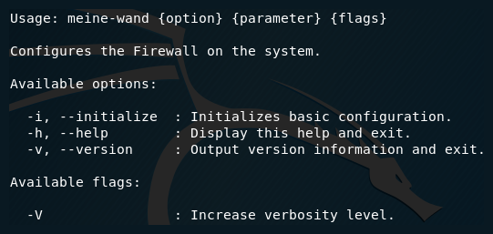

# Meine Wand

[](https://travis-ci.org/jocic/BASH.MeineWand) [](https://coveralls.io/github/jocic/BASH.MeineWand?branch=master) [](https://www.codacy.com/app/jocic/BASH.MeineWand?utm_source=github.com&amp;utm_medium=referral&amp;utm_content=jocic/BASH.MeineWand&amp;utm_campaign=Badge_Grade) [](https://packagist.org/packages/jocic/google-authenticator)

Meine Wand was originally a collection of my personal scripts for Firewall management on Debian and Debian-based Linux distributions, but it evolved into a script that can be used for Firewall configuration, incident logging, etc.

**Project is still under development...slow ride...take it easy...**



Script has been tested on the following distributions:

*   Ubuntu 18.04
*   Debian 9.5

[](https://www.paypal.me/DjordjeJocic)

## Notes

**Note #1:** As I use TunnelBear (it was generally proven to be the best VPN available) you may notice that IP addresses of their servers are used in some scripts ex. the one for creating an Onion-like environment. I'll try to change that in the future and support other VPN providers ex. HMA, NordVPN, etc. BEAR with me for now.

**Note #2:** All scripts are POSIX-compliant.

**Note #3:** You need "pt_conn_track" kernel module to use NetFilter scripts.

## Cheatsheet

Available general chains:

*   INPUT
*   OUTPUT
*   FORWARD

Available NAT chains:

*   PREROUTING
*   POSTROUTING
*   OUTPUT

Available actions:

*   ACCEPT
*   REJECT
*   DROP
*   LOG
*   ULOG
*   RETURN
*   SNAT
*   DNAT
*   MASQUERADE
*   REDIRECT

Available states:

*   NEW
*   ESTABLISHED
*   RELATED

## Scripts

**Note:** These will be removed soon.

### General Scripts

*   **init-basic.sh** Basic initialization script will activate UFW, remove existing rules, and set basic rules for Ubuntu distribution - denying inbound and outbound traffic except traffic to Google DNS servers and Ubuntu repositories in the United States. You can pass an interface as a parameter.

[NetFilter](src/nf/init-basic.sh) | [UFW](src/ufw/init-basic.sh)

```bash
bash ./init-basic.sh {network-interface}
```

*   **init-advanced.sh** Advanced initialization script will do everything as the basic one. In addition it will allow HTTP, HTTPS & Mail-related outbound traffic.

[NetFilter](src/nf/init-advanced.sh) | [UFW](src/ufw/init-advanced.sh)

```bash
bash ./init-advanced.sh {network-interface}
```

*   **sandbox.sh** Sandboxing script allows you to create an environment in which only traffic toward specific online services is allowed - Twitter, GitHub, LinkedIn & GoDaddy (UK). All inbound and outbound traffic that isn't related to the mentioned services is blocked, even DNS-related traffic.

[NetFilter](src/nf/sandbox.sh) | [UFW](src/ufw/sandbox.sh)

```bash
bash ./sandbox.sh {network-interface}
```

*   **onion.sh** This script is used for creating an onion-like environment by utilizing 2 or more VPN servers of your desired VPN provider. Number of physical or virtual machines depends on the number layers you selected.

[NetFilter](src/nf/onion.sh) | [UFW](src/ufw/onion.sh)

```bash
bash ./sandbox.sh {network-interface} {vpn-interface} {vpn-ip-address}
```

### UFW Scripts

*   **check.sh** Script is used for checking UFW status every second in a minute. If the UFW is inactive, all network interfaces are immediately shut down to prevent a potential breach. It should be ran by a CRON job.

[Script](src/ufw/check.sh)

```bash
* * * * * bash /location/to/script/check.sh &
```

## Alias

If you plan to use the script everyday, you should probably create an alias.

### Temporary Alias

```bash
alias meine-wand="/path/to/your/folder/meine-wand.sh"
```

### Permanent Alias

```bash
echo alias meine-wand="/path/to/your/folder/meine-wand.sh" >> ~/.bash_aliases
```

## Installation

Alternatively, you can add my personal APT repository to your machine and install **Meine Wand** like you would anything else.

Add the repository.

```bash
wget -nc https://www.djordjejocic.com/files/apt/Release.key
sudo apt-key add Release.key
sudo echo "deb http://apt.djordjejocic.com general main" >> "/etc/apt/sources.list"
sudo apt-get update
```

Install project.

```bash
sudo apt-get install meine-wand
```

## Contribution

Please review the following documents if you are planning to contribute to the project:

*   [Contributor Covenant Code of Conduct](code-of-conduct.md)
*   [Contribution Guidelines](contributing.md)
*   [Pull Request Template](pull-request-template.md)
*   [MIT License](license.md)

## Support

Please don't hessitate to contact me if you have any questions, ideas, or concerns.

My Twitter account is: [@jocic_91](https://www.twitter.com/jocic_91)

My support E-Mail address is: [support@djordjejocic.com](mailto:support@djordjejocic.com)

## Copyright & License

Copyright (C) 2019 Đorđe Jocić

Licensed under the MIT license.
